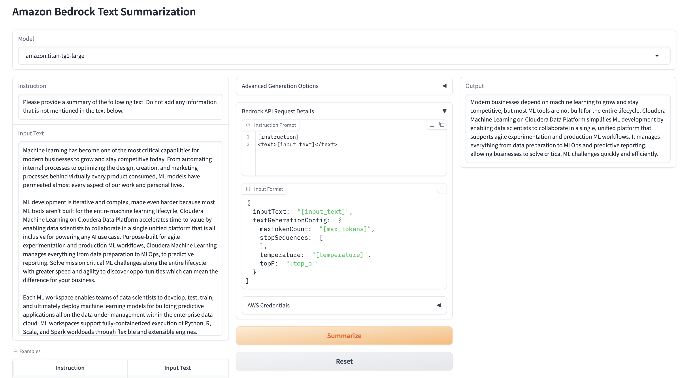

# Text Summarization and more with Amazon Bedrock

Amazon Bedrock is a fully managed service that makes foundation models from leading AI startups and Amazon available via an API, so you can choose from a wide range of foundation models to find the one that is best suited for your use case. 

This repository demonstrates using an instruction to summarize a text using the Amazon Bedrock API.

## AMP Overview

In this AMP we will show you how to setup your environment and use the Amazon Bedrock API and its models. There are two models that you can choose from.

The models we will be highlighting are **amazon.titan-tg1-large** and **anthropic.claude-v2** (supports 100K tokens in the prompt).
When calling each of these models using the API, it is important to note the format of the prompt it expects and the schema of the request API.



The instruction prompt is also customizable to instruct the called model to perform a different text generation task. For example, an engineered prompt to provide a very simple and understandable summarization might look like this:

*Please explain CML at a 5 year old level.*
````
Machine learning is a big helper for companies to do their work and make their products better. It helps automate things and make decisions faster. Cloudera Machine Learning makes it easier for scientists to work together and create machine learning models. They can use different languages and computers to do this in one place. It also helps keep track of everything and make sure it works well.
````

## AMP Setup

You must have an AWS account with access to Bedrock and the following environment variables defined with your corresponding account details.
- **AWS_DEFAULT_REGION**
- **AWS_ACCESS_KEY_ID**
- **AWS_SECRET_ACCESS_KEY**

If you would like to use a federated role, you can set up BEDROCK_ASSUME_ROLE in the Project Environment variables after AMP launch. (Remember to restart the configured CML Application as well.)

### Enable AWS IAM permissions for Bedrock

The AWS identity you set here must have sufficient [AWS IAM permissions](https://docs.aws.amazon.com/IAM/latest/UserGuide/access_policies.html) to call the Amazon Bedrock service.

For example, To grant full bedrock access to your identity, you can:

- Open the [AWS IAM Console](https://us-east-1.console.aws.amazon.com/iam/home?#)
- Find your [Role](https://us-east-1.console.aws.amazon.com/iamv2/home?#/roles)
- Select *Add Permissions > Create Inline Policy* to attach new inline permissions, open the *JSON* editor and paste in the below example policy:
```
{
    "Version": "2012-10-17",
    "Statement": [
        {
            "Sid": "BedrockFullAccess",
            "Effect": "Allow",
            "Action": ["bedrock:*"],
            "Resource": "*"
        }
    ]
}
```

## AMP Requirements

### CPU
- CML CPU workloads with resource profiles up to (2 vCPU / 8 GiB Memory) will be provisioned
### CML Runtime
PBJ Workbench - Python 3.9 - 2023.08

# Jupyter Notebook Examples
We have included a notebook example that demonstrate the code in the rest of the AMP project in a more digestible manner.

## Text summarization example
A [notebook example](summarization_example.ipynb) is provided to demonstrate what text summarization using the Amazon Bedrock API looks like in a single script.
### Recommended Runtime
PBJ Workbench - Python 3.9 - 2023.08
### Recommended Resource Profile
2 vCPU / 4 GiB Memory

## Note
This AMP references examples from the following Amazon [user guide](https://github.com/aws-samples/amazon-bedrock-workshop) to call Bedrock APIs.
